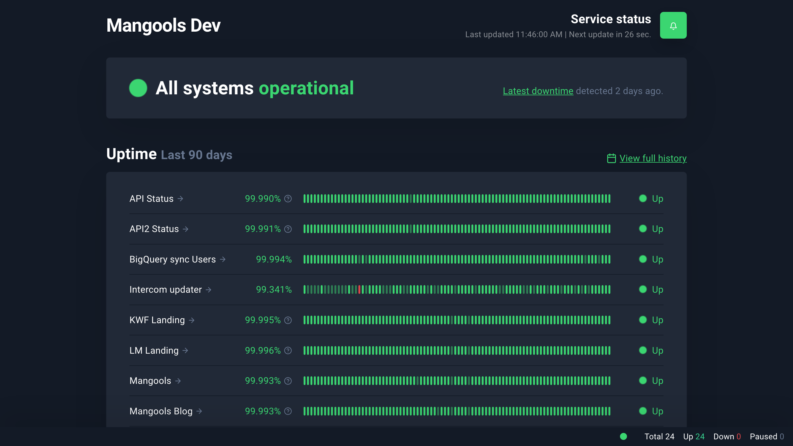
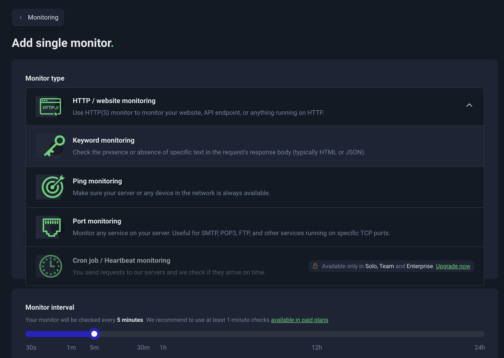
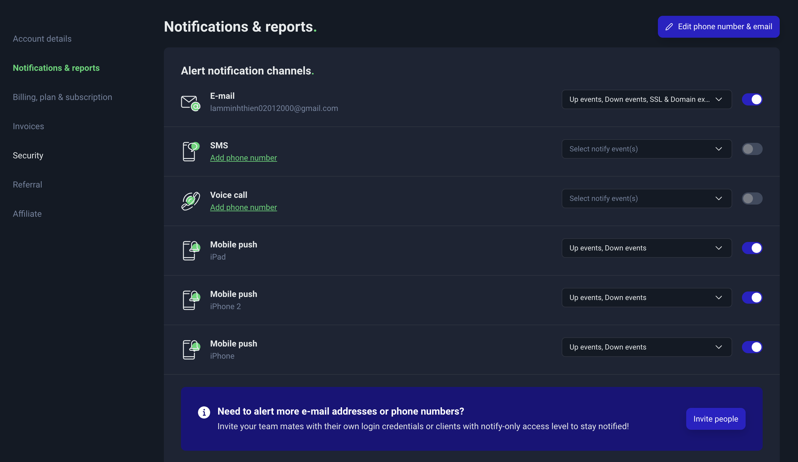
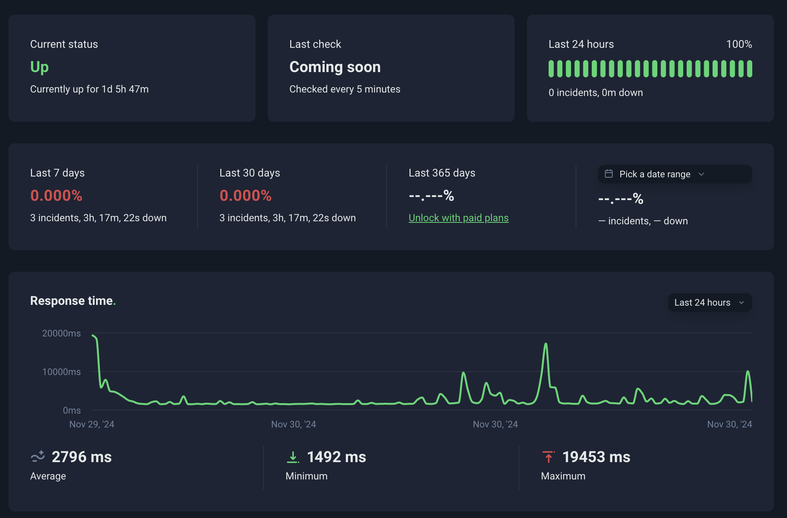
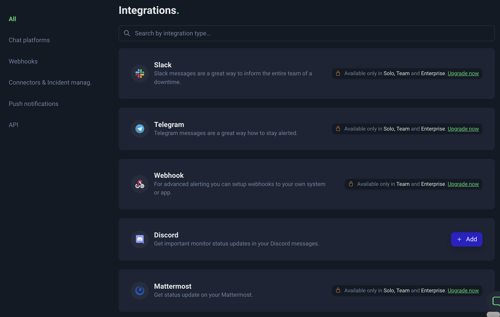

# Hướng Dẫn Sử Dụng Uptime Robot

Uptime Robot là một công cụ giúp theo dõi trạng thái hoạt động của các website, API, hoặc server. Hệ thống sẽ gửi thông báo khi phát hiện downtime hoặc bất kỳ vấn đề nào. 

## 1. Đăng ký và Đăng nhập
1. Truy cập trang web: [https://uptimerobot.com/](https://uptimerobot.com/).
2. Nhấp vào nút **Sign Up Free** để tạo tài khoản (hoặc đăng nhập nếu đã có tài khoản).
3. Điền email, mật khẩu và xác nhận tài khoản qua email.
---

## 2. Tạo Monitor (Giám sát)
### Bước 1: Đăng nhập vào tài khoản
Sau khi đăng nhập, bạn sẽ được chuyển đến bảng điều khiển (Dashboard).

### Bước 2: Thêm Monitor

1. Nhấp vào nút **Add New Monitor**.
2. Trong cửa sổ bật lên, cấu hình như sau:
   - **Monitor Type**: Chọn loại giám sát:
     - **HTTP(s)**: Kiểm tra trạng thái của URL.
     - **Ping**: Kiểm tra độ phản hồi của server qua IP.
     - **Port**: Kiểm tra trạng thái của port (ví dụ: HTTP, HTTPS, FTP).
     - **Keyword**: Tìm kiếm một từ khóa cụ thể trên trang.
   - **Friendly Name**: Đặt tên cho monitor (ví dụ: "Website Chính").
   - **URL or IP**: Nhập URL hoặc địa chỉ IP cần giám sát.
   - **Monitoring Interval**: Chọn khoảng thời gian kiểm tra (5, 10, hoặc 15 phút).
3. Nhấp **Create Monitor** để hoàn tất.

---

## 3. Cấu hình Thông báo (Alerts)

1. Vào mục **My Settings** hoặc **Alert Contacts** từ menu bên trái.
2. Thêm phương thức nhận thông báo:
   - **Email**: Nhập địa chỉ email để nhận thông báo.
   - **SMS**: Cần đăng ký gói trả phí để nhận qua SMS.
   - **Webhook**: Cấu hình URL webhook để tích hợp với các công cụ như Slack, Discord, hoặc Teams.
   - **Push Notification**: Dùng ứng dụng di động Uptime Robot để nhận thông báo.

---

## 4. Theo dõi Báo cáo

1. Từ Dashboard, bạn sẽ thấy danh sách các monitor cùng trạng thái hiện tại (Up/Down).
2. Nhấp vào tên monitor để xem chi tiết, bao gồm:
   - Thời gian downtime gần nhất.
   - Thời gian phản hồi (Response Time).
   - Lịch sử uptime theo ngày, tuần, tháng.

---

## 5. Quản lý và Tối ưu
- **Chỉnh sửa Monitor**: Nhấp vào biểu tượng bánh răng cạnh monitor để chỉnh sửa cấu hình.
- **Public Status Page**: Tạo trang hiển thị trạng thái công khai:
   1. Vào **Public Status Pages** > **Add New Status Page**.
   2. Chọn các monitor muốn hiển thị và nhấn **Save**.
   3. Chia sẻ link với khách hàng hoặc đội ngũ.

---

## 6. Tích hợp với Công cụ Khác

Uptime Robot hỗ trợ tích hợp với nhiều công cụ như:
- **Slack/Discord**: Sử dụng webhook để nhận thông báo trực tiếp trong kênh.
- **Zapier**: Kết nối với các ứng dụng như Google Sheets, Gmail.
- **API**: Sử dụng API để truy vấn dữ liệu hoặc tự động hóa (tham khảo tại [Uptime Robot API Docs](https://uptimerobot.com/api/)).

---

## 7. Câu Hỏi Thường Gặp
### 1. Làm thế nào để kiểm tra tần suất downtime?
Trong mục chi tiết monitor, chọn **Logs** để xem lịch sử downtime.

### 2. Tại sao không nhận được thông báo?
- Kiểm tra cài đặt thông báo trong **Alert Contacts**.
- Đảm bảo email hoặc webhook được cấu hình chính xác.

### 3. Có gói miễn phí không?
Có, Uptime Robot cung cấp gói miễn phí với:
- Tối đa 50 monitors.
- Thời gian kiểm tra tối thiểu: 5 phút/lần.

---

Nếu cần thêm hỗ trợ, bạn có thể truy cập trang [Help Center](https://support.uptimerobot.com/).
